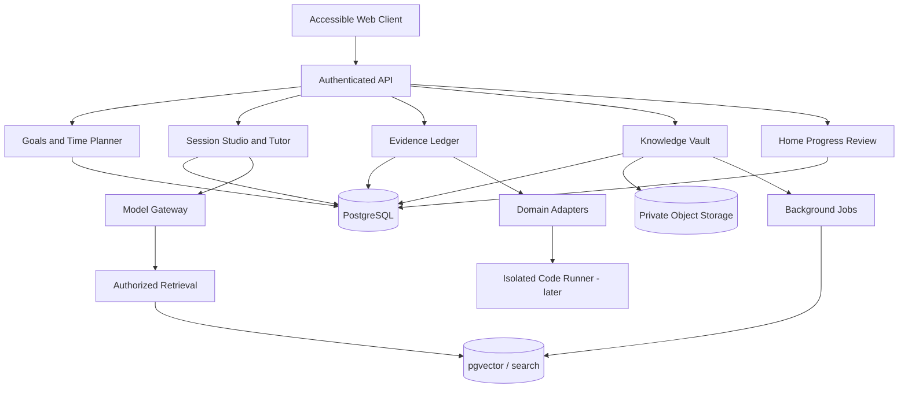

# Dolphin — Universal, Adaptive Learning Platform
## Master Product Design & Engineering Specification

**Document status:** Build specification / product vision — not a claim of implemented functionality  
**Version:** 1.0  
**Date:** September 23, 2026  
**Audience:** Product designer, full-stack developer, AI engineer, education specialist, security reviewer, and Cursor coding agent  
**Preferred tagline:** *Learn anything. Fit the time you have. Prove you can do it.*  
**Product name:** **Dolphin** (locked). Atlas, Coyote, Tallymark, Planmoor, Planhaven, and related candidates are retired — cite prior packages as source history only.

> **Non-negotiable product identity:** Dolphin is a comprehensive, all-in-one learning platform — **not** a short-course generator, flashcard app, AI chat wrapper, or deadline planner. Time-adaptive learning is one cross-cutting capability inside a broader system: AI tutoring (Session Studio), user-owned resources, curricula, concept maps, hands-on activities, assessment (Evidence Ledger), retention, projects, and learning analytics. Ship an honest, useful vertical slice first; expand without rewriting foundations.

**Omega vision (locked):** an all-in learning platform for **anyone**, for **anything**, in **any time**, **personalized for each user**. Architecture welcomes every domain; V1 still ships a deep vertical slice without fake “all subjects fully validated” claims.

---

# 0. How to use this specification in Cursor

1. Read this entire document — especially Sections 1–3, 5–9, 11–17, and 20–22 — before implementing.
2. Inspect the existing repository, package manager, conventions, tests, and deployment environment. **Do not overwrite working code or pick incompatible versions blindly.** If starting empty, use the stack in Section 11.
3. Keep `docs/implementation-status.md` current: what is implemented, mocked, blocked, and the next small vertical slice. Update after every milestone.
4. Build **Phase 0 → Phase 1A (Prove Loop) → Phase 1B → Phase 2…**. One working end-to-end route before widening. Section 20 = sequence; Section 21 = acceptance contract.
5. Preserve domain boundaries and schemas so later subject adapters plug in without rewriting user, goal, lesson, or assessment systems.
6. Never pretend incomplete features are live. Hide them or label “Coming later”; never ship inert interactive controls.
7. Treat schedules, mastery estimates, completion times, model output, and AI-generated answer keys as **provisional** unless supported by validated evidence.
8. Each milestone ships usable UI, persistence, validation, authorization, error handling, and at least one automated test — not static mock screens alone.
9. If a choice conflicts with privacy, learner agency, assessment honesty, or secure execution, prioritize those principles and document the trade-off.
10. This spec defines **desired capabilities**, not permission to expose unsafe code execution, scrape copyrighted content indiscriminately, collect children's data, or claim unsupported mastery.

**Deliverables:** source code; readable README and `.env.example`; schema migrations and seed data; automated tests; responsive web app; implementation status; known limitations; deployment instructions. Phase 1A must work with seeded content even if no LLM API key is configured.

**Companion docs:** `docs/project-context.md` (stable decisions), `docs/brand-shortlist.md` (name lock + conflicts), `docs/build-plan.md` (sequential small steps), `docs/implementation-status.md` (milestone tracker).

---

# 1. Executive product definition

## 1.1 One-sentence vision

Dolphin turns any appropriately scoped subject, question, personal resource, or skill objective into a guided learning experience that adapts to starting knowledge, goals, **real available minutes**, demonstrated performance, and preferred interaction methods — then helps the learner practice, retain, and independently apply what they learned.

## 1.2 Problems to solve

Learners patch together courses, videos, notes, AI chat, flashcards, calendars, exercises, and project repos. Context breaks across tools; exposure is confused with competence; plans ignore the person’s actual time budget. General AI chat answers questions but does not provide a coherent curriculum, controlled practice, traceable sources, independent assessment, or retention planning.

Dolphin is the **learning home** that joins those jobs. It does not replace human teachers, accredited credentials, physical training, or licensed professionals.

## 1.3 Primary jobs to be done

- “I have 20 minutes; explain and let me practice exactly this concept.”
- “I have an exam in 2 weeks and 45 minutes on weekdays; help me prioritize my notes and find gaps.”
- “I want to become capable of building web apps over 6 months; teach, test, and help me ship a project.”
- “I have a PDF, slides, lecture video, or my own notes; teach me from this material and cite the source.”
- “I learned something last month. Help me remember it and apply it without hints.”
- “I am moving from algebra to circuits and programming; preserve relevant knowledge and make connections.”
- “I need to change my deadline or study time; replan without deleting previous progress.”

## 1.4 Outcomes, not screen-time goals

**North-star outcome:** improvement on appropriately designed **independent, delayed, goal-relevant assessments**, plus practical project completion and user-reported usefulness. Secondary: planned-session completion, review adherence, accessibility task success, satisfaction, cost per successful learning session. **Never** equate streaks, AI messages, time spent, or course completion with learning. No streak guilt.

## 1.5 Product boundaries

| Boundary | Decision |
|---|---|
| Launch population | Adults **18+**, self-directed; age-gate until a child-specific product is designed and reviewed. Do not infer age or health traits from performance. |
| V1 subjects | **Python** + **foundational math** + **generic reading/writing** path via shared competency/lesson abstractions. Welcome other domains in architecture; do not advertise validated mastery for unimplemented domains. |
| V1 device | Accessible responsive **web**; mobile-first Session Studio; desktop-friendly labs. Native, offline sync, institutional tenanting, real-time voice, live video, community = later. |
| Outcome boundary | Education and practice — not accredited credentials, guaranteed exam scores, or AI grades as formal qualification. |
| Agency | Explicit user choice can override recommendations; AI never silently deletes or rewrites learner history. |

---

# 2. Principles and research-to-product mapping

Evidence-informed design — **not** a claim that Dolphin itself has been validated. Evaluate the product before publishing efficacy claims. Cited research often concerns specific subjects/populations/tasks.

| Design principle | Implementation rule | Reference |
|---|---|---|
| Retrieval practice | Recall/solve without source; independent retry after assistance; avoid only rereading. | Roediger & Karpicke (2006) |
| Distributed practice | Plan revisits after elapsed time; separate long-term review from the initial session. | Cepeda et al. (2006) |
| Useful techniques | Practice testing + distributed practice as defaults where appropriate. | Dunlosky et al. (2013) |
| No fixed “learning styles” | Modality preferences and accessibility — never diagnose visual/auditory/kinesthetic types. | Pashler et al. |
| Inclusive instruction | Multiple means of engagement, representation, action, expression (UDL). | CAST UDL 3.0 |
| Accessible digital UX | WCAG 2.2 AA target. | W3C WCAG 2.2 |
| Responsible generative AI | Accuracy, harm, privacy, oversight, measurement. | NIST AI RMF GenAI Profile |
| Defend AI workflows | Treat uploads/retrieved content as untrusted; constrain tools; validate outputs. | OWASP GenAI Top 10 |

**Pedagogical constraints:**

- Not every session uses the same recipe. Balance attempt vs explanation for complex tasks.
- Assistance changes evidence quality: mark `independent`, `hinted`, `worked_example`, `collaborative`, or `self_reported`.
- Never classify a user as “low ability.” Skill estimates are local, time-varying, uncertain.
- Delayed checks → retention evidence; new-context tasks → transfer. Neither is inferred from lesson completion alone.
- A short deadline prioritizes what fits; it does not redefine mastery or promise arbitrary compression.

---

# 3. Personas, contexts, and major scenarios

| Persona | Needs | Example |
|---|---|---|
| Time-constrained explorer | Immediate focused explanation + practice | “Learn what an API is in 15 minutes.” |
| Exam-prep learner | Material fidelity, prioritization, deadline planning | “Calculus exam in two weeks; use my lecture PDFs.” |
| Career-changing learner | Months-long curriculum, projects, persistent progress | “Learn Python and build working automation.” |
| Returning learner | Detect forgotten prerequisites; skip redundancy | “Matrices a year ago; resume with a diagnostic.” |
| Multilingual / a11y-focused | Flexible media, captions, keyboard/SR | “Teach this in plain Spanish with captions.” |
| Creative / physical-skill | Demos, practice instructions, honest auto-eval limits | “Basic guitar chords; submit a performance clip.” |

**Core scenarios:**

**A. Two-hour Python:** goal + 120-minute budget → brief diagnostic → realistic small-program objective → Session Studio → editor-supported exercises → independent challenge → “what you can now do.”

**B. Two-week math exam:** deadline, permitted days, minutes/day, syllabus PDFs → *actual available minutes* → diagnose → map concepts → daily sessions with review → rebalance after misses.

**C. Six-month programming path:** capability + project milestone → prerequisite graph → multi-stage curriculum → weekly cadence → independent assessments → spaced revisits → capstone + Evidence Ledger portfolio.

**D. Learn from sources:** authorized PDF → processing status → page-aware structure → cited answers + practice → flag bad citations → delete resource.

**E. Cross-subject continuity:** algebra then circuits; graph may propose prerequisites; prior evidence used only with permission; never assume transfer automatically.

---

# 4. Product pillars and scope taxonomy

## 4.1 First-class pillars (product locks)

These three are non-negotiable product identity — not optional modules:

1. **Centralized learning dashboard (Home)** — hub: next best action, active goals, available session length, due reviews, recent Evidence Ledger snapshot, Quick Learn / start-something-new.
2. **Time-adaptive learning** — plans from **real available minutes**, feasibility / scope conflict, versioned replan after misses or constraint changes.
3. **Honest capability evidence (Evidence Ledger)** — assisted vs independent, delayed retention, project/application evidence; no fake global “% mastered,” no streak-as-learning.

## 4.2 Eight permanent platform pillars

Every release preserves a path for each (not every pillar is fully implemented in MVP):

1. **Goals & Time Intelligence** — NL goal intake, deadlines, availability, urgency, workload, feasibility, dynamic replan.
2. **Curriculum & Competency Graph** — diagnosable skills, edges, path versions, sequencing, user-editable direction.
3. **Session Studio & Adaptive Tutor** — grounded teaching, guided practice, hints, modes, explicit assistance control.
4. **Knowledge Vault** — personal docs + curated sources, structure-aware processing, private retrieval, citations.
5. **Interactive Learning Labs** — typed activities and domain adapters (text, flashcard, math, code, writing; later audio/sim/video).
6. **Assessment & Evidence Ledger** — diagnostic/formative/independent checks, provenance, confidence, portfolio artifacts.
7. **Retention & Planning** — targeted review, calendar, missed-day repair, spaced retrieval.
8. **Progress, Agency & Accessibility** — truthful Progress, privacy, export/delete, WCAG-targeted UX, transparent AI limits.

**Release labels:** `P0 / Phase 1` = first vertical slice; `P1 / Phase 2` = Vault, richer labs/assessment; `P2 / Phase 3+` = more adapters, modalities, analytics, collaboration, offline/native. Architectural seams for later phases may exist; never fake live integrations in the UI.

---

# 5. Detailed functional requirements

IDs are stable for tickets and acceptance tests.

## 5.1 Identity, onboarding, preferences

- `ID-01 [P0]`: Managed email auth or verified OAuth/OIDC; secure sessions, logout, protected routes, ownership checks. Never roll a custom password system.
- `ID-02 [P0]`: Optional display name, locale, timezone, language, a11y/format preferences; skip + later edit.
- `ID-03 [P0]`: Adult-only enrollment + transparent privacy notice; do not collect sensitive health attributes to personalize.
- `ID-04 [P0]`: First-use: create a goal quickly; advanced preferences only as needed.
- `ID-05 [P1]`: Export/delete account/data with confirmation and retention disclosure.
- `ID-06 [P2]`: Institution/educator accounts only after role model, consent, retention, child-safety, and compliance review.

## 5.2 Universal goal creation and time constraints

- `GOAL-01 [P0]`: Create/edit/pause/archive goal from free text + optional structured target; show normalized objective before save.
- `GOAL-02 [P0]`: `quick_learn` or `learning_journey`; convert quick → journey without losing attempts/notes.
- `GOAL-03 [P0]`: Inputs: start, optional deadline, total minutes **or** recurring weekly availability, preferred session length, priority (`understand | apply | deepen`), starting confidence, scope constraints, optional assessment date.
- `GOAL-04 [P0]`: Validate contradictory inputs; ask for correction with safe default — never silently invent a budget.
- `GOAL-05 [P0]`: Adjust timeframe/availability/goal anytime; persist plan version; explain key changes.
- `GOAL-06 [P1]`: Optional calendar import with explicit permission; must work without it.
- `GOAL-07 [P1]`: Templates: exam, exploration, language, career, project, creative/physical, source study.

## 5.3 Knowledge graph, diagnostics, curriculum

- `GRAPH-01 [P0]`: Competencies store objective, domain, level, measurable success criterion, effort range, assessment kind, provenance.
- `GRAPH-02 [P0]`: Edges `REQUIRES`, `PART_OF`, `RELATED_TO`, `APPLIES_TO`, `EQUIVALENT_TO`; prerequisites DAG where needed.
- `GRAPH-03 [P0]`: Diagnostic samples representative skills; confidence ≠ proof; allow skip.
- `GRAPH-04 [P0]`: Plan generator uses diagnostic, objective, dependencies, time budget; deterministic constraints + seeded curriculum before unreviewed AI graphs.
- `GRAPH-05 [P0]`: Show rationale, lessons, milestones, approximate study time, skipped/out-of-scope topics.
- `GRAPH-06 [P1]`: Edit/reorder with informed warnings; compare plan versions.
- `GRAPH-07 [P1]`: Verified core graph + private per-user state; uploads never silently become shared content.
- `GRAPH-08 [P2]`: Expert domain packages, alternate paths, graph viz, cross-subject linking.

## 5.4 Session Studio and tutor

- `STUDIO-01 [P0]`: Session Studio stores session state, current objective, remaining allotted minutes, activity list, attempts, assistance, pause/resume, completion. No forced countdown or automatic loss of work.
- `STUDIO-02 [P0]`: Modes: `guided`, `independent_challenge`, `direct_explanation`, `explore`. Learner can always switch explicitly.
- `STUDIO-03 [P0]`: Short explanation, worked example when appropriate, active attempt, targeted hint, independent retry; do not auto-reveal answers in challenge mode.
- `STUDIO-04 [P0]`: Full solution on request → label evidence assisted → generate a different independent check.
- `STUDIO-05 [P0]`: Tutor retrieves only authorized profile/learning-state/source context; distinguish source statements from AI synthesis.
- `STUDIO-06 [P0]`: Deterministic seeded content works without AI API key; AI visibly disabled if unconfigured.
- `STUDIO-07 [P1]`: Provider-agnostic gateway; structured outputs, retries, observability, bounds, fallbacks, cancellation.
- `STUDIO-08 [P1]`: Citations link to exact page/section/chunk; “no reliable source found” is valid.
- `STUDIO-09 [P2]`: Speech I/O, multimodal demos, multilingual voice; personalities = tone, not fictional credentials.

## 5.5 Activities, assessments, Evidence Ledger

- `ASSESS-01 [P0]`: Typed activities: reading/demo, MCQ, short answer, numeric/formula, reflection, resource-linked question. No free-form LLM grade as verified mastery.
- `ASSESS-02 [P0]`: Stable item IDs/versions, answer key/rubric, competency mapping, difficulty, time estimate, provenance, validation state.
- `ASSESS-03 [P0]`: Append-only attempts: timestamps, independent/assisted, hint count, question version, evaluator, result; duplicate-submission protection.
- `ASSESS-04 [P0]`: Deterministic eval for closed-form; ambiguous/free-text → feedback with uncertainty, not certification.
- `ASSESS-05 [P0]`: Status facets: `not_started | exposed | practicing | independently_demonstrated | retained | applied`. Never award retained/applied from same-session correct alone.
- `ASSESS-06 [P1]`: Delayed unseen checkpoints, transfer tasks, validated math/code, rubric-assisted writing.
- `ASSESS-07 [P1]`: Misconception feedback + “this grade is wrong” report.
- `ASSESS-08 [P2]`: Calibrated probabilistic mastery only after validity/fairness studies + educator review tooling.

## 5.6 Memory, review, scheduling

- `REVIEW-01 [P0]`: Independent correct → may schedule future review; assisted → nearer independent practice (do not falsely extend intervals).
- `REVIEW-02 [P0]`: Transparent staged review; persist `due_at`, history; do not name it FSRS unless FSRS is correctly integrated.
- `REVIEW-03 [P0]`: Home/Review show due items + reason; snooze/skip/reschedule within constraints.
- `REVIEW-04 [P1]`: Distinguish fact recall, conceptual reasoning, procedural application; vary activity types.
- `REVIEW-05 [P1]`: Missed sessions → replan achievable tasks; never dump everything onto one day; preserve elapsed-time evidence.
- `REVIEW-06 [P2]`: Calibrated spacing estimators with evaluation and opt-in research where appropriate.

## 5.7 Knowledge Vault

- `VAULT-01 [P1]`: Signed uploads for permitted PDF/TXT/MD; MIME/magic/size/quota/malware checks.
- `VAULT-02 [P1]`: Processing states `pending|processing|ready|partial|failed|deleted`; recoverable errors.
- `VAULT-03 [P1]`: Extract paragraph/page/heading structure; no invented page numbers.
- `VAULT-04 [P1]`: Chunk, embed, index with per-user filters; hybrid retrieval; permission-check before model use.
- `VAULT-05 [P1]`: Cited answers + evidence panel; say when material is missing; label outside-source suggestions.
- `VAULT-06 [P1]`: Outline/course proposal/source questions; **validate keys and citation spans before graded use**.
- `VAULT-07 [P1]`: Deletion removes storage, retrieval entries, derived copies per retention policy; handle races with jobs.
- `VAULT-08 [P2]`: Slides, OCR, audio/transcripts, video timestamps, Git, bookmarks — only when quality/licensing are clear.

## 5.8 Labs, projects, portfolios

- `LAB-01 [P0]`: Generic activity renderer by type; unsupported → honest text alternative.
- `LAB-02 [P1]`: Math lab with graphing + deterministic symbolic/numeric checker.
- `LAB-03 [P1]`: Code lab with editor, visible tests, **isolated** remote execution (strict CPU/mem/time/FS/network). **Never execute learner code in the API process.**
- `LAB-04 [P1]`: Project brief, tasks, rubric, artifact/URL submission, evidence, optional private portfolio export.
- `LAB-05 [P2]`: Writing/speaking studios, science sims, creative/physical evidence with candid auto-eval limits.
- `LAB-06 [P2]`: Optional GitHub after scoped auth; never require publishing private educational work.

## 5.9 Dashboard, agency, accessibility

- `DASH-01 [P0]`: Home = next best action, active goals, available session length, due reviews, recent evidence, “start something new.”
- `DASH-02 [P0]`: Progress distinguishes exposure / practice / independent / retention / application / unassessed — no deceptive global mastery %.
- `DASH-03 [P0]`: Responsive, WCAG 2.2 AA target, keyboard, focus, contrast, zoom, captions/transcripts where applicable, reduced motion.
- `DASH-04 [P0]`: Loading/empty/error/cancel/retry; stable data after refresh.
- `DASH-05 [P1]`: Text size, reading complexity, locale/captions, tutor modes, notifications, explainable recommendations.
- `DASH-06 [P1]`: Private notes, bookmarks, search, learner-controlled portfolio.
- `DASH-07 [P2]`: Groups/mentor, educator dashboards, institutional policies, moderation, minor protections.

---

# 6. Time Intelligence Engine — cross-cutting, not the entire product

## 6.1 Distinct time concepts

Never confuse **calendar horizon** with **available study effort**:

| Field | Meaning |
|---|---|
| `start_at` | Learner start instant + timezone |
| `deadline_at` | Optional completion/exam deadline |
| `total_budget_minutes` | One-off budget **or** computed from study slots — never double-count |
| `weekly_availability` | Per-day windows and/or minutes + exclusions |
| `preferred_session_minutes` | Chunk size ≠ total hours |
| `target_retention_until` | Optional retention horizon beyond deadline |
| `priority` | `understand` \| `apply` \| `deepen` |
| `required_outcomes` / `optional_outcomes` | Destination competencies; optionals may cut under tight time |
| `time_estimate_range` | Low/high effort — not false-precision guarantee |

Presets: 10/15/30 min, 1/2/4 h, 1 day, 2 weeks, 1/3/6/12 months + custom. For “2 weeks,” still ask **how many hours are actually available**.

## 6.2 Time-budget algorithm

**Invariant:** never silently drop mandatory prerequisites, fake assessments, or label incomplete competencies mastered to meet a deadline.

1. Normalize to UTC + IANA timezone; materialize recurring local windows; handle DST.
2. Build eligible study windows; subtract breaks and already-scheduled sessions → `usable_budget`.
3. Diagnose / skip only where independently demonstrated.
4. Effort **ranges** per activity; update conservatively from completed sessions; do not infer ability from speed alone.
5. Allocate share for teaching, practice, assessment, and — when horizon permits — distributed review.
6. Constrained schedule: prerequisites, deadline, windows, ranges, min practice, priority, mandatory assessments, preferences. Start with topo order + greedy weighted selection.
7. If `estimated_required_low > usable_budget` → **scope conflict**: show what fits / what doesn’t; offer reduce goal / add time / extend deadline / accept introductory-not-mastery. Keep original goal visible.
8. Versioned plan with rationale for included/omitted/postponed; completion **range**, not invented probability.
9. On completion, miss, diagnostic update, or goal edit → **new** plan version; retain old versions and evidence.

**Example:** 14 days × 30 min/day = 420 minutes before exclusions — not “two weeks of continuous learning.”

### Minimal planning interfaces (illustrative)

```ts
type LearningPriority = "understand" | "apply" | "deepen";
type PlanMode = "quick_learn" | "learning_journey";

interface StudyWindow {
  localDayOfWeek: 0 | 1 | 2 | 3 | 4 | 5 | 6;
  startLocal: string; // HH:mm
  endLocal: string;
}

interface TimeBudget {
  mode: PlanMode;
  timezone: string;
  startsAt: string;
  deadlineAt?: string;
  oneOffMinutes?: number;
  weeklyWindows?: StudyWindow[];
  excludedLocalDates?: string[];
  preferredSessionMinutes: number;
  targetRetentionUntil?: string;
  priority: LearningPriority;
}

interface PlanFeasibility {
  status: "feasible" | "partially_feasible" | "insufficient_data";
  usableMinutes: number;
  estimatedRequiredMinutes: { low: number; high: number };
  includedCompetencyIds: string[];
  deferredCompetencyIds: string[];
  reasonCodes: string[];
  proposalText: string;
}

interface PlanVersion {
  id: string;
  goalId: string;
  version: number;
  parentPlanVersionId?: string;
  timeBudgetSnapshot: TimeBudget;
  feasibility: PlanFeasibility;
  scheduledActivities: Array<{
    activityId: string;
    competencyId: string;
    startsAt?: string;
    allocatedMinutes: number;
    activityKind: string;
  }>;
  generatedAt: string;
}
```

Use a proper IANA timezone library. Test DST transitions. Never add “24 hours” to a local start and assume the next local day shares the same clock time.

## 6.3 Same subject, different budgets (Python)

| Input | Appropriate scope | Honest evidence |
|---|---|---|
| 15 min | Variables + basic output, two quick attempts | Recognition + small independent edit; no mastery claim |
| 2 h | I/O, conditions/loops, tiny program, independent challenge | One small working program + explicit unresolved topics |
| 2 wk × 30 min/day (~7 h) | Selected fundamentals, mini-project, review | Limited practical foundation |
| 2 wk × 2 h/day (~28 h) | Broader fundamentals, files, project, tests, distributed review | Stronger preliminary evidence — still not “Python mastered” |
| 6 mo × 5 h/wk | Foundations, testing, projects, revisits | Portfolio + independently verified competencies |

Prior skill changes what fits. Do not reduce goals to a fixed hour→syllabus map.

## 6.4 Replan triggers and policy

**Triggers:** goal/deadline/availability change; missed session; overruns; prerequisite gap; repeated errors; faster independent performance; source add/remove; new time-critical assessment.

**Policy:** keep completed activities and history; mark future items `rescheduled` / `deferred` / `removed_from_current_plan` with reason; never silently extend deadlines; never recommend all-night cramming or punish breaks; no forced timers unless the assessment requires timed practice and the learner opts in.

## 6.5 Illustrative scheduler pseudocode

```python
def build_plan(goal, learner, competencies, study_windows):
    budget = sum(w.available_minutes for w in study_windows)
    prerequisite_closure = required_prerequisites(goal.target_competencies, competencies)
    candidates = topo_sort(prerequisite_closure | goal.target_competencies)
    candidates = [c for c in candidates if not independently_verified(learner, c)]

    selected, postponed = [], []
    reserved = reserve_required_diagnostic_and_assessment_time(goal, budget)
    remaining = max(0, budget - reserved)

    for competency in rank_by_goal_relevance_then_prerequisite_order(candidates):
        bundle = minimum_viable_learning_bundle(competency, learner, goal.priority)
        if bundle.estimated_high_minutes <= remaining and prerequisites_satisfied(
            competency, selected, learner
        ):
            selected.append(bundle)
            remaining -= bundle.estimated_high_minutes
        else:
            postponed.append(competency)

    return create_versioned_plan(
        selected=selected,
        postponed=postponed,
        feasible=(not postponed),
        remaining_minutes=remaining,
        rationale=explain_tradeoffs(selected, postponed, goal),
    )
```

Policy illustration only — real code needs persisted activities, partial scope, tests for invariants, and ranking that never violates prerequisites.

---

# 7. Personalization and knowledge-state model

## 7.1 Learner model dimensions

Keep separate: (a) stated preferences, (b) diagnostic/performance evidence, (c) availability, (d) accommodations without medical inference, (e) topic goals, (f) self-reported confidence, (g) review history. No universal “intelligence” or “learning style” field.

```ts
type EvidenceKind =
  | "diagnostic" | "guided_practice" | "independent_check"
  | "delayed_check" | "transfer_task" | "project_review" | "self_report";

type AssistanceLevel =
  | "none" | "hint" | "worked_example" | "collaborative" | "direct_answer";

type CompetencyStatus =
  | "not_started" | "exposed" | "practicing"
  | "independently_demonstrated" | "retained" | "applied";

interface CompetencyEvidence {
  userId: string;
  competencyId: string;
  activityVersionId: string;
  evidenceKind: EvidenceKind;
  assistanceLevel: AssistanceLevel;
  evaluator: "deterministic" | "human" | "ai_provisional" | "self_report";
  evaluatedResult?: "correct" | "partial" | "incorrect" | "unverified";
  occurredAt: string;
  delayedFromInitialLearningMinutes?: number;
  assessmentContext?: string;
}
```

**Minimum status policy:**

- `exposed` — encountered material (≠ understanding).
- `practicing` — attempted relevant problems.
- `independently_demonstrated` — passed validated/human-reviewed unseen assessment without meaningful assistance.
- `retained` — separately scheduled delayed assessment with recorded delay (same-session repetition ≠ retention).
- `applied` — new-context or authentic project task with evaluator provenance.

These are **facets**, not a forced single ladder. Store multiple evidence summaries; avoid mutually exclusive states that erase nuance.

## 7.2 Initial personalization policy

- Insufficient diagnostic → short sample + provisional plan.
- Reliable independent prereqs → offer skip/short review.
- Shared misconception pattern → corrective example + unseen independent practice.
- Recent reliable independent success → increase challenge / transfer; keep learner control.
- No robust assessment for a domain → track completion/reflection separately from verified mastery.
- Full solution requested → comply in practice mode; label evidence; never frame help as failure.
- Inaccessible format → accommodate while preserving construct.

## 7.3 Question selection

Select by coverage, validity, difficulty, recency, assistance history, near-duplicate avoidance. Do not reuse the exact item as the decisive independent test. Block `unreviewed` AI-generated items from high-stakes mastery updates.

---

# 8. User journeys and end-to-end state transitions

## 8.1 First launch → first independently completed activity (Prove Loop)

1. Landing explains Dolphin as a complete personal learning system, not a proficiency guarantee.
2. Sign in (or limited guest preview that cannot masquerade as a durable account).
3. NL goal → Quick Learn or Journey → budget/deadline + **actual** availability; skip optional prefs.
4. Backend normalizes → proposed objective, prerequisite estimate, feasibility range.
5. User confirms; optional 3–8 diagnostic prompts or “start from basics.”
6. Create `goal`, `time_budget`, `diagnostic`, `learning_path`, `plan_version`, `session`; show included vs deferred outcomes.
7. Session Studio: content + practice from persisted activity definitions; answers → `attempt` records.
8. Hint/solution/pause/mode change; assistance history persists.
9. Feedback + new independent check + next step.
10. Session summary: topics encountered, independent attempts, unresolved misconceptions, review recommendation, remaining plan.

**Critical:** refresh at steps 6–10 without data loss; unauthorized users cannot read/modify this user’s goals, files, or attempts.

## 8.2 Uploaded material → source-backed curriculum

Upload → validate → private resource + signed upload → extract/index → link to goal → “use only my material” vs labeled external refs → cited Session Studio answers → flag gaps → deletion invalidates index/derived artifacts (assessment history may remain without exposing removed source text).

## 8.3 Deadline / availability changes

Edit → recompute remaining minutes → before/after proposal → user accepts → new immutable plan version; active session stable unless user restarts.

## 8.4 Misses and competing goals

Misses change future planning only. Rank by urgency, value, prerequisites, minimum viable bundles. Competing goals → user-editable allocation. “I have 20 minutes now” → bounded activity or Quick Learn without corrupting the journey.

## 8.5 Quick Learn → Journey

Offer continuation; carry real diagnostic/attempt evidence; label exposure/practice/independent honestly; never auto-upgrade to retention.

---

# 9. Information architecture and UX specification

## 9.1 Global navigation (P0 lock)

**Simplify P0 nav:** primary **Learn / Review / Library / Progress** + **More** (Settings, Projects when present, account).

- **Home** is the product hub (default Learn landing / `/app`) — next action, goals, feasibility, due reviews, evidence snapshot, Quick Learn.
- **Learn** — goals, path overview, Session Studio entry.
- **Review** — due queue.
- **Library** — Knowledge Vault (P1; P0 may show honest empty/coming-later for uploads, with seeded Library content if available).
- **Progress** — Evidence Ledger–oriented analytics.
- **More** — Settings, Projects, Privacy, help.

Within Session Studio, use a contextual workspace — do not bounce the learner across many top-level pages. All routes addressable; state preserved.

```text
/                       marketing or auth redirect
/sign-in                managed authentication
/onboarding             optional preferences + first goal
/app                    Home (learning dashboard hub)
/app/goals/new          goal + timeframe/availability wizard
/app/goals/:goalId      objectives, plan, feasibility
/app/goals/:goalId/edit timeframe, scope, preferences
/app/learn/:sessionId   Session Studio
/app/review             due items + history
/app/library            files and linked sources
/app/library/:resourceId preview + citations
/app/projects           portfolio (P1+)
/app/progress           Evidence Ledger analytics
/app/settings           profile, access, privacy, export/delete
```

## 9.2 Core screens

**A. Home:** one primary next action (“Continue: solving equations — 20 min”); due reviews; active goals with feasibility note; Quick Learn; recent independent evidence; empty-state → create first goal. No streak counters, leaderboards, or punitive missed-day shame.

**B. Goal wizard:** Step 1 goal → Step 2 deadline + *actual* availability → Step 3 priority/preferences → Step 4 optional diagnostic → Step 5 plan preview + inclusion rationale. Always allow back/edit.

**C. Learning path:** accessible ordered list (graph viz optional later); prereq / needs-practice / demonstrated / deferred labels; session cards with minutes + evidence objectives; “Why this next?”; edit deadline.

**D. Session Studio:** title + competency; quiet progress + remaining estimated effort (not punishing countdown); main content; context panel (tutor, notes, citations, lab); hint / show solution / submit / pause. Mobile: tabs/sheets, not four squeezed columns. Seeded path when AI unavailable.

**E. Library (Vault):** uploads, processing status, ownership/deletion, linked goals, preview + highlight; honest extraction limits.

**F. Review:** due by competency, why due, estimated minutes, snooze, independent question, schedule update.

**G. Progress (Evidence Ledger view):** goals vs allocated time; independent vs exposure; misconceptions; upcoming review; project artifacts; no fabricated precision or competitive ranking.

**H. Settings:** language, density, reduced motion, default session length, planned days, optional non-punitive notifications, privacy/export/delete.

## 9.3 Visual design direction — Clear Depth

- **Brand:** Dolphin — calm depth, fluid adaptation, trustworthy clarity. Adult, contemporary, curious — not childlike mascot-spam, sterile enterprise, or generic AI chat clone.
- **Avoid:** indigo–purple AI cliché; warm cream + high-contrast serif + terracotta cliché; streak/leaderboard chrome; neon glow stacks.
- **Tokens (verify contrast on real pairings):**
  - Deep water ink `#0B1F2A`
  - Seafoam action `#1FA7A0`
  - Foam surface `#F4F8F9` / elevated `#E8F1F3`
  - Signal amber `#E6A817` (CTAs/alerts — not terracotta)
  - Mist text secondary `#5A6B73`
  - Meaningful light theme first; dark mode later if contrast-validated
- **Typography:** expressive, purposeful — **Syne** (display) + **Manrope** (UI) + **IBM Plex Mono** (code/math plaintext). Avoid Inter/Roboto/Arial/system as the design voice.
- **Atmosphere:** subtle depth gradients / soft water-grain patterns; real learning imagery as visual anchors where used — not abstract purple blobs as the main idea.
- **Cards:** default no cards in hero/marketing; in-app, use borders/surfaces only when they aid interaction.
- **Motion:** 2–3 intentional motions (e.g. Home next-action entrance, Session Studio activity crossfade, plan feasibility reveal). Respect `prefers-reduced-motion`.
- **Feedback:** inline and specific; friendly without celebration spam or gamified pressure.

## 9.4 Screen behavior matrix

Every async feature needs idle/loading/success/empty/partial/error/cancelled where applicable. Uploads/generation need progress + job IDs. Network errors preserve unsent work; retries must not duplicate attempts. Labels, focus, disabled explanations, keyboard alternatives required. Goal/deadline/plan changes show what is preserved.

---

# 10. Content architecture and subject adapters

## 10.1 Hierarchy

`Domain → Topic → Competency → Learning Activity → Assessment Item → Evidence`.

Competencies have observable success criteria and optional prerequisites. Activities may map to multiple competencies; each assessment states what it actually measures. Resources ≠ proof of learning. Lessons group activities; plans order lessons toward goals.

Domain adapters supply suitable activity/assessment/evidence types while sharing learner/goal/timing infrastructure. Math/code may emphasize prerequisites; history chronology/sources; art technique/projects; language communicative goals.

## 10.2 Adapter contract

```ts
interface DomainAdapter {
  domainKey: string;
  supportedActivityTypes: string[];
  proposeCompetencies(input: GoalContext): Promise<CompetencyProposal[]>;
  buildActivities(input: ActivityContext): Promise<ActivityDefinition[]>;
  validateItem(item: ActivityDefinition): Promise<ValidationResult>;
  evaluateAttempt(input: AttemptContext): Promise<AssessmentResult>;
  proposeTransferTask(input: CompetencyContext): Promise<ActivityDefinition | null>;
  accessibilityAlternatives(item: ActivityDefinition): AccessibilityAlternative[];
}
```

Adapters return evidence to shared assessment policy — they do not write mastery directly. Every adapter exposes evaluation limits and a fallback.

## 10.3 Adapter releases

| Tier | Scope |
|---|---|
| Shared P0 | Reading, explanations, MCQ, short answer, numeric, reflection, generic project checklist |
| Math P1 | Notation, graphs, validated symbolic/numeric, equation editor, a11y text alternatives |
| Code P1 | Editor, tests, isolated runner — **Python first** |
| Writing / Language / Science / Creative P2 | Per-domain activities with documented auto-eval limits |

**“Learn anything” honesty:** accept generic goals in P0; when specialized tools/assessments are missing, offer reading/practice/reflection and disclose gaps. No “all subjects fully supported” badges until true.

---

# 11. Technical architecture

## 11.1 Recommended stack

**Default greenfield:** Next.js (React + TypeScript) web; FastAPI (Python) API + AI/domain services; PostgreSQL + SQLAlchemy 2 + Alembic; pgvector when Vault retrieval is on; S3-compatible object storage; Redis + Python job queue for extraction/generation; provider-agnostic AI adapter; managed OIDC; Playwright + Vitest/RTL + Pytest; Docker Compose for **local infra only**. Pin currently supported stable versions after compatibility checks.

If a coherent TypeScript backend already exists, keep a monorepo unless Python math/document tooling justifies a small separate service. Avoid dual backends for resume keywords.

**Pattern:** modular monolith + async workers. AI calls server-side; credentials never in the browser.

## 11.2 Logical flow



## 11.3 Module boundaries

| Module | Owns | Must not own |
|---|---|---|
| `identity` | auth mapping, preferences, access policies | prompts or score changes |
| `goals` | goals, timeframes, plan revisions | historic attempt mutation |
| `curriculum` | domains, competencies, graph, approved items | private resource visibility |
| `sessions` | Session Studio progress, messages, assistance | declaring verified retention alone |
| `assessment` | attempts, evaluator provenance, evidence derivation | LLM direct SQL writes |
| `review` | due schedule, outcomes | erasing missed history |
| `vault` | file ownership, extraction, index, retrieval permissions | sharing without authorization |
| `ai_gateway` | providers, limits, validated structured responses | raw ownership decisions |
| `labs` | activity renderers/evaluators | in-process code execution |
| `analytics` | privacy-respecting metrics | causal claims from engagement data |

Communicate via typed services/domain events — not direct cross-module table writes. Prefer in-process events + DB transactions/outbox where async correctness matters.

## 11.4 Suggested repository tree

```text
dolphin/
├── README.md
├── .env.example
├── docker-compose.yml
├── AGENTS.md
├── docs/
│   ├── dolphin-master-design.md
│   ├── implementation-status.md
│   ├── architecture-decisions/
│   ├── api/
│   └── evaluations/
├── apps/web/
├── services/api/
│   └── app/modules/{identity,goals,curriculum,sessions,assessment,review,vault,labs,ai_gateway}/
├── packages/contracts/
└── infra/
```

Create modules when implementing them. OpenAPI/schema generation is the contract SoT.

## 11.5 Infrastructure notes

Stateless API + TLS; relational SoT; workers with idempotency; private buckets + short-lived signed URLs; Redis never sole durable store for plans/evidence/ownership; search scoped by owner before similarity; model gateway with usage limits and validators.

## 11.6 Versioning

Immutable item/plan versions; attempts reference seen versions; UTC instants + IANA local windows; transactional submit → attempt → evidence → optional review (or durable outbox).

---

# 12. Relational data model (logical)

Implement with migrations and native types. Ownership enforced server-side.

| Table | Essentials | Invariants |
|---|---|---|
| `users` | id, auth_subject, email, created_at, deleted_at | Unique auth subject |
| `learner_profiles` | user_id, timezone, locale, preferences_json | 1:1; no inferred sensitive conditions |
| `goals` | id, user_id, title, raw_request, normalized_objective, mode, priority, status | Owner index; preserve original request |
| `time_budgets` | goal_id, timezone, starts_at, deadline_at, one_off_minutes, preferred_session_minutes, weekly_windows_json, excluded_dates_json, version | Exactly one budget mode; nonnegative durations |
| `domains` / `competencies` / `competency_edges` | keys, objectives, effort ranges, edge types | Unique keys; no self-loop; prevent prereq cycles |
| `goal_competencies` | goal_id, competency_id, requirement, priority_weight | Mandatory vs optional |
| `diagnostics` / `diagnostic_items` | owner-scoped, item versions | Retriable incomplete |
| `learning_paths` / `plan_versions` / `plan_activities` | versioned feasibility + rationale | Immutable after accept; unique path+version |
| `lessons` / `activity_versions` | typed payloads, keys, rubrics, validation_status | Answer keys withheld in challenge mode |
| `sessions` / `session_events` | resumable, append-only events | Idempotent completion; unique client_event_id |
| `attempts` / `evaluations` | assistance, idempotency_key, evaluator provenance | Immutable answer snapshot |
| `competency_evidence` / `competency_state` | evidence trail + denormalized cache | State recomputable from evidence |
| `review_items` / `review_events` | due_at, transparent policy | Append-only history |
| `resources` / `resource_chunks` / `source_links` | private object keys, extraction_version | Scope-by-owner before search |
| `projects` / `project_submissions` | rubrics, artifacts | Private by default |
| `background_jobs` / `audit_events` | progress, error codes | No secrets in user UI |

**Auth rules:** server checks on every nested ID; RLS defense-in-depth when compatible; vector similarity never grants access; curated competencies may be public-read; private state is not shared.

---

# 13. API contract (target map)

Version under `/api/v1`. Consistent errors, auth, validation, idempotency for attempts and high-impact mutations. Generate OpenAPI + typed clients. Not every endpoint is Phase 1A.

| Method + route | Purpose | Phase |
|---|---|---|
| `GET /me`, `PATCH /me/preferences` | Profile | P0 |
| `POST/GET/PATCH /goals…` | Goals | P0 |
| `POST /goals/{id}/diagnostic`, `POST /diagnostics/{id}/attempts` | Diagnostics | P0 |
| `POST /goals/{id}/plan-proposals`, `…/plans/accept`, `GET …/plans`, `POST …/replan` | Planning | P0 |
| `POST/GET/PATCH /sessions…`, `POST …/attempts`, `POST …/finish` | Session Studio | P0 |
| `GET /reviews/due`, `POST /reviews/{id}/attempts` | Review | P0 |
| `GET /progress` | Evidence projections | P0 |
| `POST /tutor/responses` | Tutor gateway | P1 |
| Resource upload/process/preview/questions/delete | Vault | P1 |
| Projects, `POST /labs/code/runs`, jobs | Labs | P1 |
| `GET /me/export`, `DELETE /me` | Portability | P1 |

**Error shape:** `{ error: { code, message, details, request_id } }` — 400/422, 401, 403/404, 409, 413, 429, 503 with deterministic fallback where possible. No stack traces or raw provider payloads to clients.

**Mutation convention:** proposing a plan does **not** replace the active plan until explicit acceptance.

---

# 14. AI architecture

## 14.1 Gateway rules

Runtime-configured providers; versioned prompts + fixtures; typed I/O validation; minimal necessary private context; per-user caps; async generation for slow work; audit model/prompt/retrieval/validator/usage without retaining unnecessary raw private prompts; AI **proposes** — app validates and persists. Prefer deterministic services over agent autonomy.

## 14.2 Explicit AI tasks

Goal normalizer; curriculum proposal; tutor response; item generator; open-response feedback; misconception classifier; plan explainer — each with schema gates before user-facing or graded use.

## 14.3 Tutor policy

Sees: auth user, current goal/objective, relevant evidence summaries, session/assistance history, mode, preferences, authorized snippets, remaining session estimate. **Does not** receive unrelated account history or authority to write mastery.

- **Guided:** find sticking point → one usable hint → attempt → alternate explanation if needed.
- **Challenge:** withhold full answer until asked → record help → fresh independent item.
- **Direct explanation:** clear answer without forced Socratic theater.
- **Explore:** open questions; mark as exposure unless a valid task completes.

## 14.4 RAG / Vault pipeline

Upload metadata → private object → verify/scan → extract structure → chunk with offsets → embed/index with owner scope → query with **auth filter before** retrieval → cite verified spans only → deletion tombstones and cleanup races. RAG is not self-validating; prefer expert-reviewed items for graded assessments.

## 14.5 Failure modes to test

Fabricated citations; prompt injection in PDFs; cross-user similarity leakage; assistance reclassification without rewriting history; mid-stream timeout; cyclic/impossible plan proposals rejected by validators.

---

# 15. Security, privacy, safety

## 15.1 Controls

Managed auth; object-level authorization; TLS + encryption at rest; upload allowlists + malware scan; treat user docs as untrusted for LLM; isolated code sandbox (later); CSP/sanitized Markdown; dependency/secret scanning; least-privilege CI.

**Never** give a model direct SQL, arbitrary internal URL fetch, or ownership bypass. Tools are narrow, separately authorized requests.

## 15.2 Privacy UX

Minimize collection; private-by-default sources/messages/submissions; export/delete before calling production-ready; no sale of learning histories; no default training on private educational content; minimized analytics; specialist review before minors/schools (COPPA/FERPA/etc.).

## 15.3 Safety

Distinguish education from medical/legal/financial advice or unsupervised hazardous procedures; report unsafe/misleading outputs; age-sensitive social/voice/unrestricted execution out of adult MVP.

---

# 16. Review scheduler and assessment quality

**P0 review policy (illustrative):** after independent success, short next-day check then increasing intervals (e.g. 1, 3, 7, 14 days) on successful delayed reviews — configurable starters, not claimed optima. Assisted/failed → nearer practice + later separate independent check.

**Quality pipeline:** competency mapping + key/rubric + validation status → seed review → immutable attempt context → evaluator with appeals → derive status only from eligible evidence → periodic fairness/validity review.

| Observation | Permissible | Must NOT happen |
|---|---|---|
| Watched lesson | Exposure | Independent mastery |
| One lucky MCQ | Correct attempt, low confidence | Strong mastery |
| Solved after hints | Assisted practice | Unassisted performance |
| Unseen validated task unassisted | Independent demonstration (scope) | Assume retention/all related skills |
| Delayed check passed | Retention for task/horizon | Permanent knowledge promise |
| Project + human rubric | Application + artifact | Accredited credential |

---

# 17. Quality attributes and metrics

## 17.1 Initial nonfunctional targets (measure and revise)

Core content visible ~3s on representative midrange mobile (RUM — not a guarantee). Deterministic P0 API p95 < 500 ms under defined moderate load excluding network/AI. Tutor streams when possible; cancel/retry. Crash-safe writes for attempts, accepted plans, deletion intents. Degraded-AI mode keeps seeded lessons, reviews, grading, progress usable.

## 17.2 Product metrics

**Funnel:** goal → plan preview → first activity → independent checkpoint → second session → delayed check.  
**Learning quality:** held-out pre/post, delayed retention, transfer, assistance-adjusted independent success, citation precision audits.  
**Trust/UX:** a11y audits, upload failures, incorrect-answer reports, privacy complaints, hallucination reports.  
**System:** latency, extraction failures, LLM cost/session, queue age, sandbox rejection, retrieval isolation, duplicate attempts.

Observational success ≠ causal proof Dolphin improved learning. Credible claims need controlled evaluation with consent and oversight.

## 17.3 Internal events (opaque IDs, no raw answers/source text)

`goal_created`, `diagnostic_started`, `diagnostic_completed`, `plan_proposed`, `plan_accepted`, `plan_replanned`, `session_started`, `activity_submitted`, `hint_requested`, `independent_check_completed`, `review_completed`, `source_uploaded`, `source_processed`, `source_citation_flagged`, `project_submitted`, `account_export_requested`, `account_deletion_requested`.

---

# 18. Test strategy

## 18.1 Pyramid

Unit (budget/DST, scheduler invariants, graph, grading, review, schemas) → integration (migrations, ownership, idempotency, Prove Loop, Vault lifecycle) → E2E browser → security (IDOR, injection, sandbox) → AI fixture eval → a11y (axe + keyboard/SR) → resilience (AI down, mid-submit fail, DST, deletion races).

## 18.2 Golden acceptance scenarios

| ID | Scenario | Expected |
|---|---|---|
| `E2E-01` | 120-min beginner Python Quick Learn | Activities ≤ 120 min; diagnostic; Session Studio; independent check; evidence |
| `E2E-02` | 2-week math, 30 min/day | Counts only eligible windows; reviews + checkpoint |
| `E2E-03` | Same deadline → 2 h/day | New proposal expands; old attempts/versions kept |
| `E2E-04` | Miss 3 windows | No overloaded catch-up day; deferred topics named |
| `E2E-05` | Request full solution | Assisted classification; new unassisted item for independent evidence |
| `E2E-06` | One lucky correct | No retention/transfer badge |
| `E2E-07` | Pass delayed check | Evidence records delay interval |
| `E2E-08` | No AI key | Seeded path works; AI controls disabled honestly |
| `E2E-09` | User B requests A’s private objects | No leak via API/list/vector/cache/signed URL |
| `E2E-10` | Prompt injection in source | No privilege escalation |
| `E2E-11` | Delete during index | Tombstone; no resurrected chunks |
| `E2E-12` | Refresh mid-lesson | Resume without duplicate writes |
| `E2E-13` | DST boundary | Local clock windows preserved |
| `E2E-14` | 20 min vs 5 h curriculum | Scope conflict; no mastery promise |
| `E2E-15` | Keyboard/SR P0 journey | Full essential flow without mouse/color-only cues |
| `E2E-16` | Quick → Journey | Evidence carried; exposure not upgraded |
| `E2E-17` | Bad AI citation/key | Validator blocks graded/cited use |
| `E2E-18` | Flaky accept retry | Idempotent; ≤ one accepted mutation |
| `E2E-19` | Code lab host/network attempt | Sandbox refuses |
| `E2E-20` | Unsupported domain goal | Generic route + clear assessment limits |

## 18.3 Definition of done

Usable mobile+desktop UI; real persistence; server authz; loading/empty/error; real control behavior; tests pass; docs/`.env.example` updated; privacy/security considered; no fake progress.

---

# 19. Risks, tradeoffs, non-goals

| Risk | Mitigation |
|---|---|
| “Learn anything” → shallow chat | Competency/evidence primitives + adapters; verified exemplar paths |
| Deadline planner replaces platform | Time feeds planning; keep Studio, Vault, Labs, Evidence, Review as first-class |
| Fake precision | Evidence type, uncertainty, ranges, unassessed gaps |
| Hallucinated facts/citations/tests | Provenance, validators, item bank, deterministic eval |
| Heavy onboarding | Progressive disclosure, editable defaults |
| Boil-the-ocean | Prove Loop first |
| Costly model calls | Cache curated lessons; deterministic planner/grader; quotas |
| Code compromise | Isolated sandbox; postpone until secure |
| Cross-user file leak | Owner scope before retrieval; IDOR + deletion tests |
| Hint dependence | Separate assisted evidence; independent/delayed/transfer practice |
| Unhealthy gamification | Optional non-punitive reminders; **no streak guilt** |

**Not initial MVP:** accredited degrees; replacing live instructors; training a foundation model; generative video; unrestricted agentic browsing; social feed; peer matchmaking; school/child accounts; public redistribution of user docs; production physics sims; automated physical-skill certification; microservice fleets.

---

# 20. Delivery roadmap and build backlog

Implementation **sequence**, not calendar duration. Validate each milestone before the next.

## Phase 0 — foundation

Inspect repo; choose stack; README + `.env.example`; DB + migrations; lint/type/test CI; managed auth + protected shell; OpenAPI contracts for goal/budget/competency/attempt/error; seed Python + math content; feature flags so nav never lies.

**Exit:** clean install, auth protected route, migrations, seed, unit + browser smoke; no private route leaks.

## Phase 1A — Prove Loop (P0)

1. Goal wizard (NL, Quick/Journey, real availability, priority, optional diagnostic).
2. Deterministic planner (seeded competencies, prereq closure, effort ranges, feasibility, accept).
3. Session Studio (≥2 activity types, explanation, guided practice, hint, independent checkpoint, pause/resume).
4. Deterministic grading + assisted vs independent Evidence Ledger updates.
5. Review due queue + working review attempt.
6. Home + Progress backed by real data.
7. E2E: 2 h Python + 2 wk × 30 min math.

**Exit:** sign in → create goal → complete real lesson/assessment → refresh/return → honest evidence + due review; works without AI key.

## Phase 1B — broaden platform

Multi-goal; path overview; replan diffs; Quick→Journey; notes/bookmarks; initial tutor gateway with fallbacks; curated lessons first-class.

## Phase 2A — Knowledge Vault

Private PDF/TXT/MD; extraction; owner-scoped search then pgvector; citations; validated generated items; deletion/isolation tests.

## Phase 2B — labs + portfolio

Math lab; secure Python runner (or editor-only until sandbox ready); projects; delayed/transfer templates; Evidence Ledger analytics.

## Phase 3 — adapters / modalities

Writing, language, science, humanities, arts; audio/diagram; empirical effort estimates without false precision; locales; outcome studies.

## Phase 4 — conditional

Mentoring/educator tools; portfolios; native/offline; school/child only after compliance; institutional SSO.

## First 12 Cursor tickets (execute in order)

| # | Ticket | Concrete result |
|---|---|---|
| 1 | `DOLPHIN-BOOT-001` | Repo inspect + app/API skeleton, README, `.env.example` |
| 2 | `DOLPHIN-BOOT-002` | Managed login, protected API, owner-scoped profile |
| 3 | `DOLPHIN-DATA-001` | Migrations: goals, budgets, competencies, plans, sessions, items, attempts, evidence, review |
| 4 | `DOLPHIN-SEED-001` | Reviewed Python/math mini-curricula; no AI required |
| 5 | `DOLPHIN-GOAL-001` | Accessible goal/time/availability wizard + server validation |
| 6 | `DOLPHIN-PLAN-001` | Actual-minute budget, prereq-safe proposal, feasibility report |
| 7 | `DOLPHIN-PLAN-002` | Plan preview/acceptance + version history |
| 8 | `DOLPHIN-STUDIO-001` | Persisted Session Studio: reading + objective question |
| 9 | `DOLPHIN-ASSESS-001` | Attempts, hints, deterministic grading, independent evidence rules |
| 10 | `DOLPHIN-REVIEW-001` | Due queue, review attempt, transparent next-due |
| 11 | `DOLPHIN-HOME-001` | Home + path + Progress from real Evidence Ledger data |
| 12 | `DOLPHIN-E2E-001` | Browser tests: 120-min Python + 2-week math; refresh + cross-user auth |

After ticket 12, **stop and demonstrate the Prove Loop** before RAG, conversational AI spectacle, code execution, or community.

---

# 21. Minimum product user stories

**A — Realistic timeframe:** enter “Learn Python in 2 hours” or “linear algebra, 2 weeks × 30 min/day” → editable scope-appropriate plan using actual windows; conflicts visible; evidence preserved on edit.

**B — Real learning, not a schedule mockup:** study content, guidance, real questions, evaluation, finish, later independent review; dashboard from attempts; solution requests ≠ independent evidence.

**C — Privacy:** goals/progress private; user B cannot fetch A’s objects; export/delete before public release.

**D — Broad goals:** unsupported specialty domains get generic route + disclosed assessment limits; no dead buttons.

**E — Accessibility & agency:** keyboard/SR, pause, full explanation on request, decline plan changes; no punitive missed-day messaging; rebase requires acceptance.

---

# 22. Cursor implementation protocol

1. **Read** this spec, code, migrations, tests, `docs/implementation-status.md`.
2. **Plan** smallest usable vertical slice, migrations, tests, privacy/a11y risks.
3. **Implement** real code + tests; typed modules; no secrets; no fake completion.
4. **Verify** with actual commands/results.
5. **Review behavior:** controls work, state persists, ownership server-enforced, evidence labels honest.
6. **Document** status, contracts, deviations.
7. **Next** only after current scope works — do not rewrite product vision or boil the ocean.

**Coding preferences:** maintainable abstractions; schema-driven contracts; typed errors; safe defaults; accessible components; no in-process arbitrary code execution; no magical single-prompt “mastery score.”

---

# 23. Bibliography (design references, not Dolphin efficacy claims)

1. Roediger & Karpicke (2006) — test-enhanced learning.  
2. Cepeda et al. (2006) — distributed practice.  
3. Dunlosky et al. (2013) — learning techniques.  
4. Pashler et al. — learning styles: concepts and evidence.  
5. CAST UDL Guidelines 3.0.  
6. W3C WCAG 2.2.  
7. NIST AI RMF Generative AI Profile (NIST AI 600-1).  
8. OWASP GenAI Top 10.  
9. FTC COPPA guidance — consult counsel before child-focused rollout.  
10. U.S. ED Student Privacy Policy Office — consult before school/institution use.

---

# 24. Final product directive

**Build the complete Dolphin foundation, deliver it in responsible stages, and never mistake the time-aware onboarding flow for the product itself.** The minimum product already connects:

**goal → feasible plan (real minutes) → Session Studio → supported practice → independently evaluated attempt → Evidence Ledger → review → Home.**

Later: learner-owned materials, rich labs, specialized adapters, projects, modalities, optional human networks — same foundation.

A learner may study for **10 minutes, two hours, two weeks, or two years**. Dolphin should always answer truthfully:

*What is my goal? Why is this next? What can I actually demonstrate? What am I still learning? What should I do next with the time I have?*
